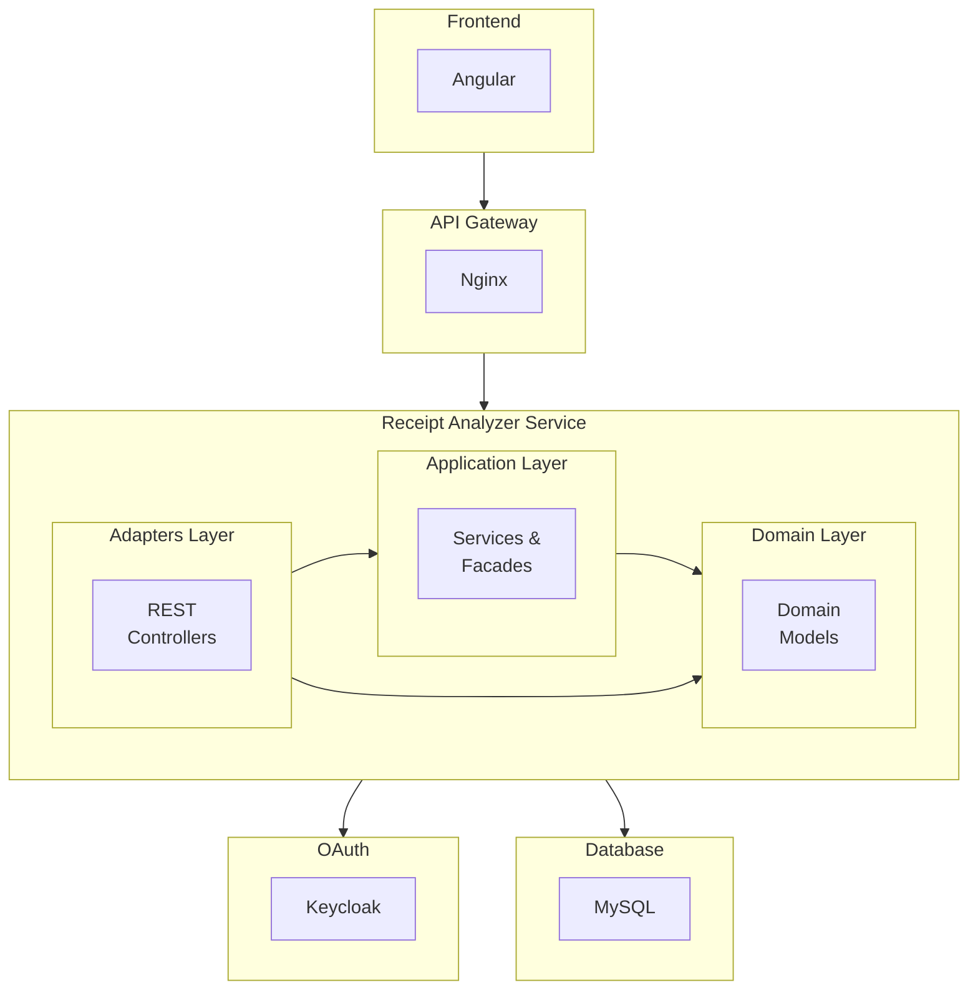

# Receipt Analyzer - Receipt Digitization and Expense Tracking

A modular web application for receipt digitization and expense tracking with advanced OCR processing. Created to collect training data for an ML model.

---

## Project Description

**Receipt Analyzer** is a comprehensive solution for:
- Receipt and invoice digitization with automatic text recognition (OCR)
- Organizing expenses in wallets
- Product categorization
- Secure access management through Keycloak
- Responsive web interface

**Key Features:**
- Automatic data extraction from PDF and JSON receipts
- Support for multiple receipt formats
- Versioning system created for training an ML model to read receipt data
- Product dictionary management
- Authentication and authorization via Keycloak
- Angular Material interface


---

## Architecture

### Architectural Pattern

The project uses Hexagonal Architecture and CQRS:


---

## Tech Stack

### Backend
```
Language:           Java 21
Framework:          Spring Boot 3.x
Build Tool:         Gradle
Database:           MySQL 8.0
Authentication:     Keycloak 26.3
OCR:                Tesseract
Persistence:        Hibernate JPA
```

### Frontend
```
Language:           TypeScript 5.8
Framework:          Angular 20.1
UI Library:         Angular Material 20.2, Bootstrap 5.3
```

### Infrastructure
```
Container:          Docker & Docker Compose
Web Server:         Nginx 1.29.3
Orchestration:      Docker Compose
```
---

## What Has Been Done?

### Core Functionality
- [x] Authentication and authorization via Keycloak
- [x] PDF file upload and processing
- [x] OCR receipt processing
- [x] Support for multiple receipt formats
- [x] Versioning system to track data corrections (for ML training)
- [x] Product dictionary with categorization
- [x] Product aliases system
- [x] Angular interface

### Architecture and Design
- [x] Hexagonal Architecture
- [x] Command Query Responsibility Segregation (CQRS)
- [x] Strategy Pattern for processing different formats

### Infrastructure
- [x] Docker containerization
- [x] Docker Compose setup (prod + local dev)
- [x] Nginx reverse proxy
- [x] Environment configuration

---

## Future Plans

- [ ] **Improved Data Reading**
    - Implementation of ML model for receipt recognition
    - Optimization for different PDF qualities
    - Asynchronous processing (RabbitMQ)

- [ ] **Support for New Store Formats**
    - Expansion to other retail chains
    - Adaptation of ML model to different formats

- [ ] **Advanced Analytics**
    - Dashboard with expense statistics
    - Expense category charts
    - Product trends over time

- [ ] **Automated Tests**
    - Backend unit tests
    - Backend integration tests

- [ ] **DevOps**
    - GitHub Actions CI/CD
    - Kubernetes deployment

---

## Contact

**Daniel Madzierski**

- Email: daniel.madzierski.pl@gmail.com
- Location: Poznań, Poland